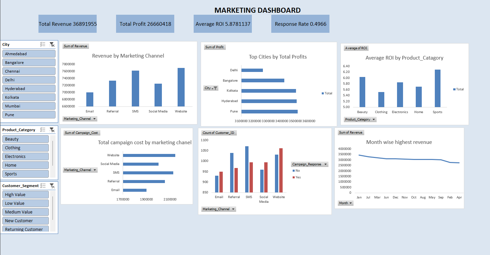
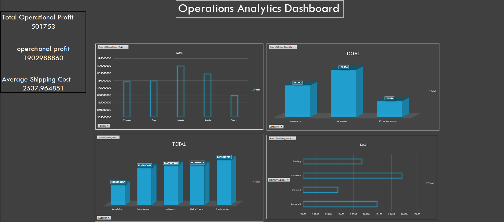

# Advance Excel Projects

This repository contains advanced Excel dashboards developed for data analysis and business decision-making. Each project demonstrates practical use of Excel features such as Pivot Tables, Charts, KPIs, and data visualization techniques.

---

## 📊 Marketing Dashboard

The Marketing Dashboard provides insights into marketing performance, campaign effectiveness, and customer engagement metrics. It helps track key indicators and supports data-driven marketing decisions.

### Dashboard Preview

---

## 📈 Operations Analytics Dashboard

The Operations Analytics Dashboard focuses on operational performance metrics such as productivity, efficiency, and workflow monitoring. It helps organizations evaluate operational outcomes and identify improvement areas.

### Dashboard Preview

---

## Tools Used

* Microsoft Excel
* Pivot Tables
* Charts and Graphs
* Data Cleaning and Analysis
* KPI Metrics

---

## Purpose of This Repository

This repository is part of my data analytics and Excel portfolio. It showcases practical dashboard development skills that can be applied in business, operations, and marketing analysis.

---

## Author

**Parthraj Paija**
MBA Student | Data Analytics & Business Intelligence Enthusiast
